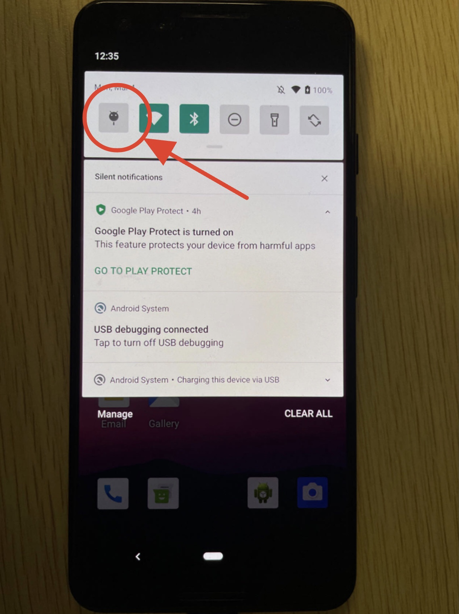

# **Experiment workflow**


## **Pre-experiment: Install apps and configure the swap partition**
Install the Google services framework:
```bash
cd evaluation
./install-apk/fastboot-google.sh
# It will reboot the system and install the Google services related packages
./install-apk/fastboot-google.sh # If there is an error the first time, execute it twice
```

We also provide some scripts to install the tested apps more easilier:
```bash
./install-apk/install-all.sh
# Or install app individually, with install-<app name>.sh
./install-apk/install-amazon.sh
./install-apk/install-facebook.sh
```
After installing these apps, it is recommended that the user manually logs into their account and completes the initialization of each app.

To configure the swap partition for both Fleet and the original Android, user can use the following commands:
```bash
adb reboot # The swap partition cannot be reconfigured if it is in use.
./fastboot-flash-swap.sh 
```
The swap partition configuration needs to be set up whenever the phone restarts.


## **Experiment-1: App caching capacity and GC working set**
All the relevant files are located in the `evaluation/exp-cache-app` directory in which there are some scripts and Jupyter notebooks.


**Caching commercial apps (Figure 11c).**
First, run the following command in the terminal from the `evaluation` folder:
```bash
python ./exp-cache-app/run-cache-commercial.py
```
The script launches apps continuously and automatically counts the number of active apps.
There is a `MANUAL_INTERACTION` variable in the Python script.
If the variable is set to `False`, it will automatically swipe the screen to simulate human usage with the app.
The number of active apps can be seen in the console output log after the `CachingNUM=` keyword.


We execute the same script test on Fleet and different baseline Android systems to start the same sequence of apps consecutively in the same way, in order to obtain the number of cached apps for the different methods (identified by the `CachingNUM=` keyword in the console).
When the script finished, it will print the summary of cached app number in the last line (begin with `cached_numbers=`).


Finially, we can paste these sequences of the number of cached apps into the drawing block in `exp-run-caching-commercial.ipynb` to generate the final result graph.


## **Experiment-2: GC working set while the app is in the background.**
This result requires additional profile information, which can be obtained by enabling the debug flag before compiling Fleet
Therefore, users need to rebuild Fleet to enable profile information.
To do this, we need to (1) modify the source code by commenting out the `#undef JIACHENG_DEBUG` line in the `runtime/jiacheng_debug.h` file; (2)  (for other experiments, the debug flag should be false).

Additionally, we need to test the Fleet in two configurations: (1) enabling BGC and (2) disabling BGC.
To enable BGC, we need to set the `ENABLE_BGC` variable to `true` and rebuild the Fleet.
To disable BGC, we need to set the `ENABLE_BGC` variable to `false` and rebuild Fleet.
(The paper, we have one more configuration, which is the original Android. It can be configured by setting `ENABLE_APGC`, `ENABLE_NRO`, `ENABLE_FYO`, and `ENABLE_BGC` all to `false` in the `runtime/jiacheng_debug.h` file.)

For every comparison of the Android system, we collect the working set alongside the execution time using the following steps:


First, we collect raw data of the mutator working set and the GC working set during their foreground and background states using two terminals. One terminal is used to monitor the Android log, and the other is used to execute the app running scripts.

Specifically, the first terminal, execute the command to monitor the Android log and save the log in a file:
```bash
adb logcat | grep jiacheng | tee ./exp-cache-app/gc-working-set-<app name>.log
```

In the second terminal, execute the command to automatically run the app:
```bash
python ./exp-cache-app/run-gc-working-set.py
```
During these two script running, we can observe the mutator and GC working set in the first terminal.
That is, the mutator working set is the value after `MutatorWS=`, and the GC working set is the value after `GcWS=`.


Second, we further use the `<app tag>:`at the beginning of each line to identify the log for a specific app.
For example, all logs of the Twitch app have the `tch.android.ap:` tag in the log line.
Therefore, we can select all logs of Twitch with the `tch.android.ap:` keyword by the command such as:
``` bash
cat ./exp-cache-app/gc-working-set.log | grep "tch.android.ap:" | tee ./exp-cache-app/gc-working-set-twitch.log`
```


To test different apps, the user can modify the line `use_utils.start_*` in the `run-gc-working-set.py` file.
Therefore, for 2 different BGC configurations and 4 tested apps, we would generate 8 log files, such as `gc-working-set-twitch-with-BGC.log`, `gc-working-set-twitch-without-BGC.log`, `gc-working-set-tiktok-with-BGC.log`, `gc-working-set-tiktok-without-BGC.log`, `gc-working-set-facebook-with-BGC.log`, `gc-working-set-facebook-without-BGC.log`, `gc-working-set-line-with-BGC.log`, `gc-working-set-line-without-BGC.log`.


**Figure 12a.** Users need to retrieve the logs outputted when the app is in the background from the saved log files.
Specifically, we select the logs when the app is in the background by select all lines between
```
<app tag>: jiacheng ConcurrentCopying::Runphases() End * GetGcCause()= RelocateHotness *
```
 and the line 
```
<app tag>: jiacheng Heap::UpdateProcessState() jank_perceptible=1
```
The first line means the Fleet complete the object grouping work and the app is in the background.
The second line means the app is switching to the foreground.
Therefore, we can further retrive the log outputed when the app is in the background by these two key lines.
After that, we can obtain the GC working set size using the `GcWS=` keyword in the retrieved log.


Based on these background GC working set data, we calculate the average and standard deviation and plot the figure in the `exp-gc-working-set.ipynb` notebook.


**Figure 12b.** We provide some analysis code blocks in `exp-gc-working-set.ipynb` notebook. Users need to update the path of `gc-working-set-twitch-with-BGC.log` and `gc-working-set-twitch-without-BGC.log` to the log of enabling BGC and disabling BGC.
Then the notebook could automatically analyze the log files and generate the result figure.


<!-- After the experiment, users should remember to rebuild Fleet by disabling `JIACHENG_DEBUG` by adding the `#undef JIACHENG_DEBUG` line in the `runtime/jiacheng_debug.h` file. -->
<!-- Enabling `JIACHENG_DEBUG` and incur high runtime overhead incurs high runtime overhead due to the numerous profile operations involved. -->


<!-- **Caching manually created apps (Figure 11a, b).**
`exp-caching-manual-create-app.ipynb` -->

<!-- **Expected Results:** -->


## **Experiment-3: Hot launch performance**

We provide relevant scripts for app hot launch testing in the `evaluation/exp-hot-launch` folder.
We use the following commands to test the hot start performance of each app under memory pressure:

```bash
python exp-hot-launch/run-launch.py
```
The script will continuously launch apps and output the hot and cold launch times in the console.
Users can also adjust the app startup sequence and number of startups in the script when there is not enough hot launch data for some apps.


When the script finished, it will print a summary of hot launch time for every apps.
User need to paste the summary hot launch time from the console to the secibd block of the `exp-hot-launch.ipynb` Jupyter Notebook.

We use the same python script mentioned above to test Fleet and the Android system that needs to be compared. Then we can update the hot start data of each app in the Android system using different methods in the `<method name>_launch_time_<app name>` array variables of the jupyter notebook.

It should be noted that the startup of certain apps can trigger the simultaneous startup of other apps that are cached in the background. However, when these cached apps are launched subsequently, the hot launch is not optimized by the runtime guided swap of Fleet.
The hot launch of the associated startup app does not accurately reflect the optimization performance of Fleet, and we have also observed that its performance is relatively poor.
Therefore, it is necessary to avoid the hot launch time record for the associated cached app that is initiated by other apps.


**Distribution of the hot launch time (Figure 13a-m).** 
After pasting the hot launch records generated by the `run-launch.py` script in the second block of `exp-hot-launch.ipynb`, we can run the whole following code blocks. 
The Jupyter notebook will analyze all hot launch time data and generate the CDF graph for all apps (Figure 13a-l) and the statistical graph (Figure 13m) after executing its subsequent blocks.


**Heap size ratio VS speed up (Figure 13n).**
Users can use the following command to check the Java heap size and the total memory footprint of apps:
```bash
./exp-hot-launch/check-heap.sh
```

The script will output the Java heap size and the total memory used by the app.
The ratio of the Java heap is calculated by dividing the Java heap size by the total memory of the app.
Users can modify this script by commenting out some of its code to select the target app.
Finally, we write the ratio of the Java heap and the avarge hot launch speed up in the corresponding code block in `exp-hot-launch.ipynb`, which will generate Figure 13n.

Please note that executing the `check-heap.sh` script incurs a high overhead on running apps. Therefore, we should not run the script while recording the hot launch times. Instead, we can run the script before or after executing `run-launch.py`.


<!-- **Expected Results:**
Fleet have faster hot launch performance than original Android. -->


## **Experiment-4: Runtime performance**
In the `evaluation/exp-runtime-performance` folder, we provide some jupyter notebooks and scrpts to measure the runtime performance including the CPU overhead and frame rendering performance.

In order to do that, an important thing is to capture a trace on the mobile device. We use the 



[system tracing document.](https://developer.android.com/topic/performance/tracing/on-device)

The captured traces are saved in the `/data/local/traces` path of the device.
We provide the `trace-pull.sh` script to help user to fetch traces from device to the host machine.


To obtain the runtime information of apps, the experiments mainly consist of two steps:
(i) utilize the `system trace` tool to capture traces;
(ii) the Trace Processor, a Python library provided by Perfetto, to analyze these captured traces.


**CPU overhead.**
First, users should turn on the `system trace` while simultaneously executing `run-once-cpu.py`.
When the Python script finishes, please close the `system trace` and fetch the captured trace from the mobile device to the development workstation. 
After obtaining the trace file, we update the `TRACE_PATH` variable in the `exp-runtime-performance.ipynb` notebook.
Finally, we execute the remaining blocks of the notebook, which analyze the trace file using Perfetto and output the CPU usage result in the last code block.


**Jank ration and FPS (Figure 14).**
Similarly, we start the system trace tool while initiating the `run-once-foreground.py` script.
After the script finishes, we close the system trace and fetch the trace file from the device.
Then, we use the `exp-runtime-performance.ipynb` notebook to analyze the trace by updating the `TRACE_PATH` to the trace file.
After running all the blocks in the notebook, it will generate the jank ratio and FPS results. 
We then paste these results into the `exp-runtime-performance-plot.ipynb` notebook which incorporates the script to plot the resulting figure.


<!-- **Expected Results:** -->

<!-- ## **Experiment customization** -->